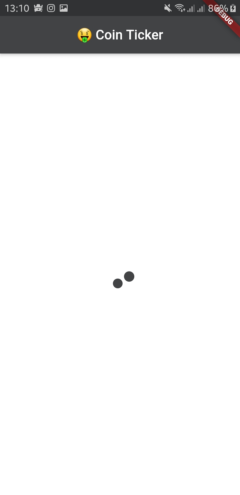
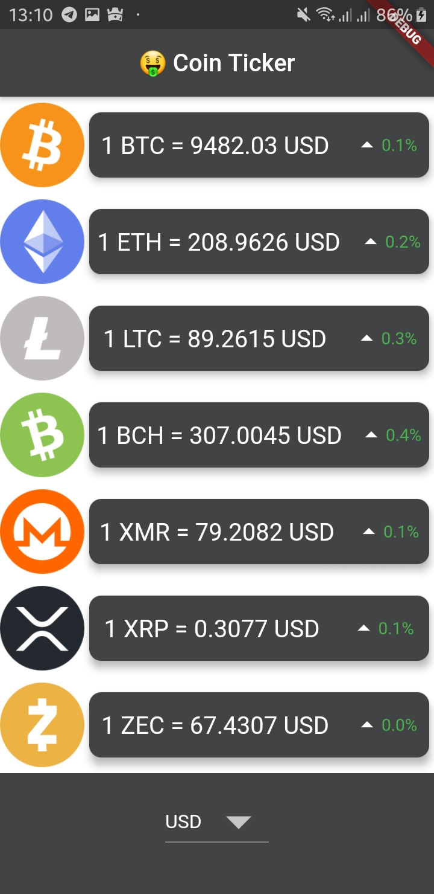

# Coin Ticker 🤑  
                 

 An App That Fetches Crypto Prices From [This API](https://apiv2.bitcoinaverage.com)

## Screenhoots

  
  
 
  

## My Goal

My objective of this App is to learn about using Cupertino and Material Widgets in parallel and providing a different user interface depending on the platform.

## What I learned

- How to use the DropdownButton Widget from Material design.
- How to loop through code using Dart for and for-in loops.
- How to use Cupertino Widgets in your app.
- How to check the platform your app is being run on to customise the UI for that platform.
- Revise previous concepts by completing the challenges.

